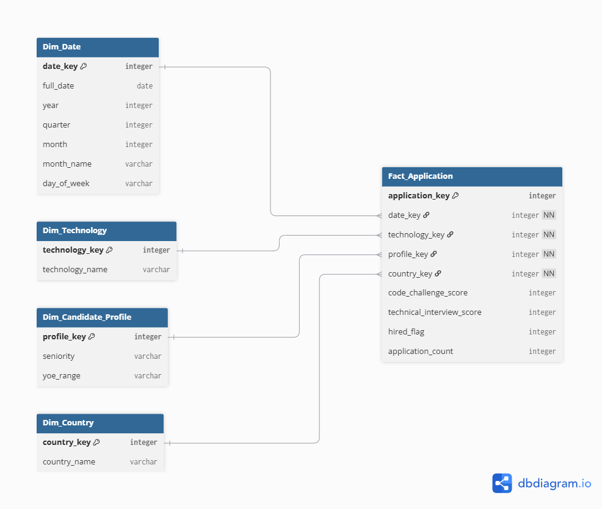
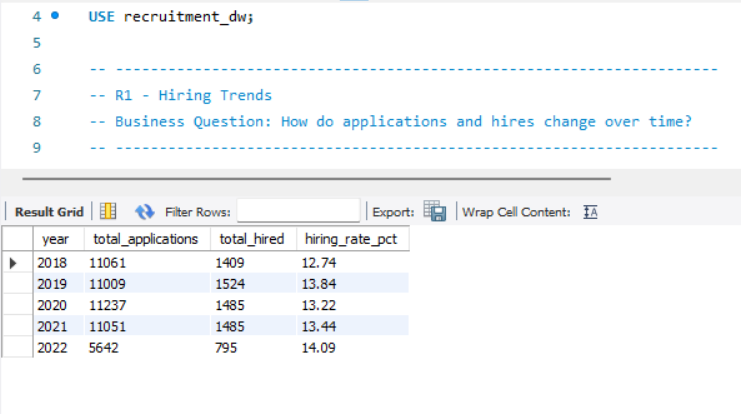
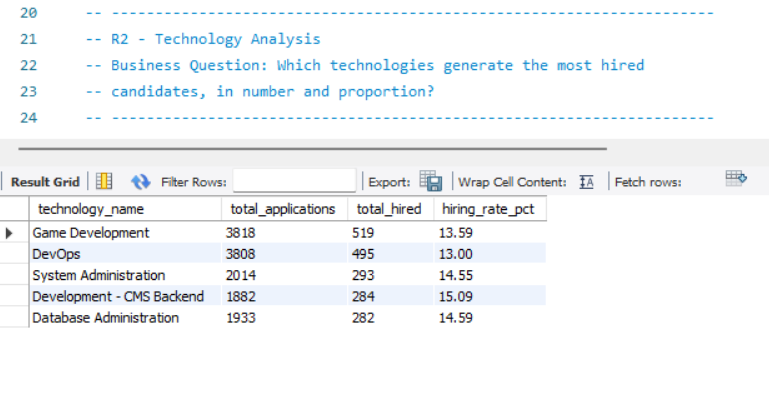
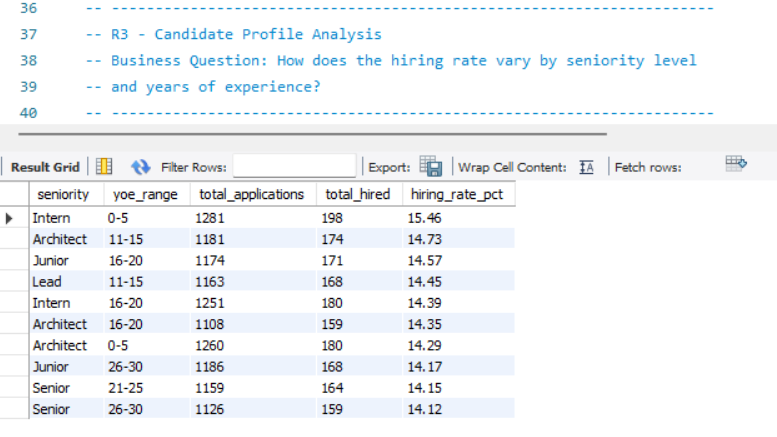
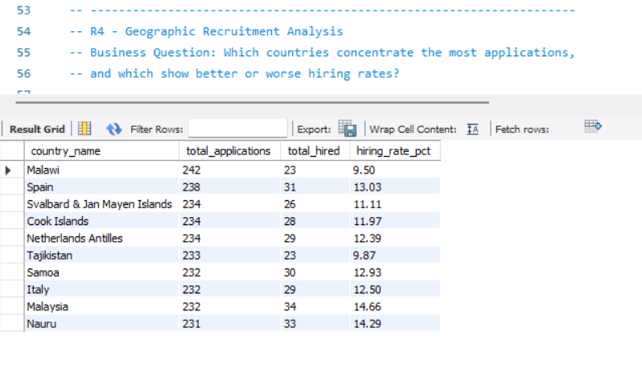
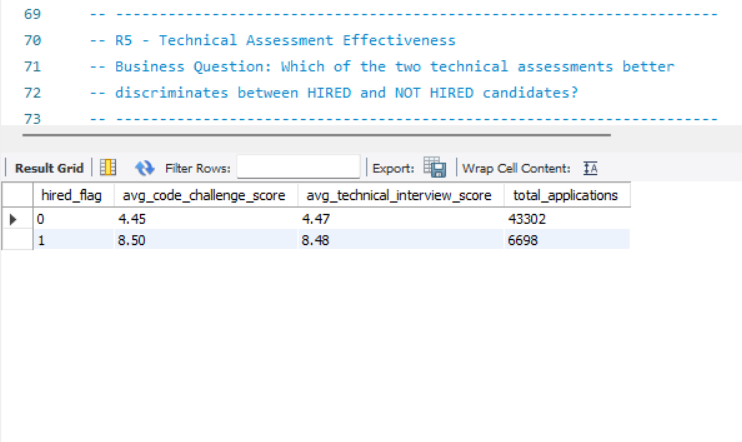
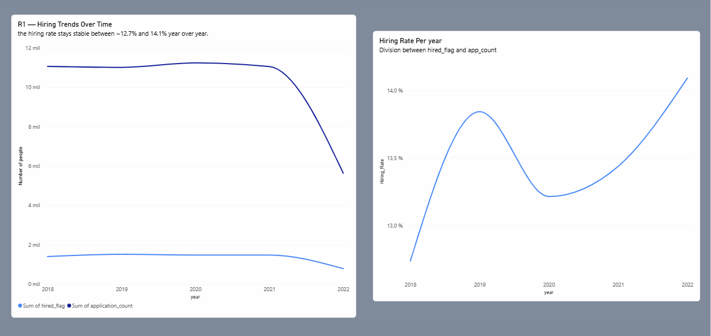
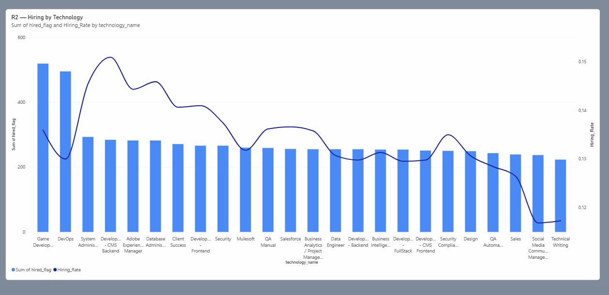
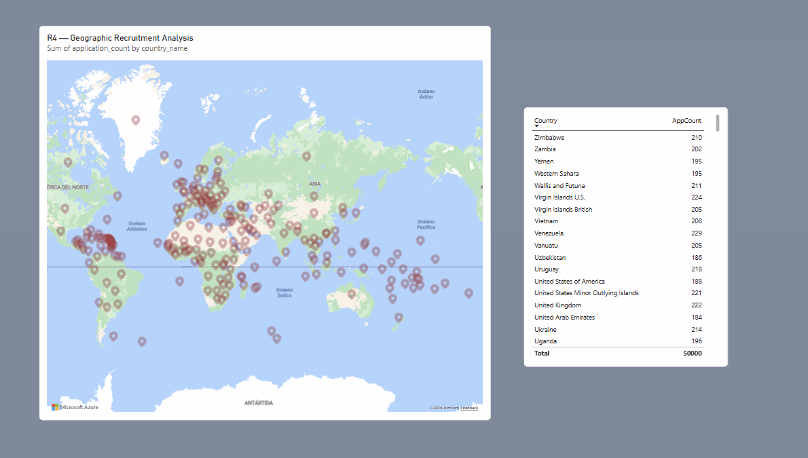

# Workshop-1: From Business Requirements to a Dimensional Data Warehouse

## 🎯 Project Objective

Design and implement a dimensional Data Warehouse that transforms raw candidate application data from a technical recruitment process into an analytical system capable of supporting hiring-related business decisions, following a full Business Requirements → Data Understanding → Dimensional Modeling → ETL → Data Warehouse → Analytics → Business Decisions workflow.

## 🏢 Business Context

A technology recruitment company wants to improve its understanding of its candidate selection process. The company receives thousands of applications from candidates with different professional backgrounds, experience levels, countries, seniority levels, and technology profiles. Each candidate is evaluated using two technical assessments: a **Code Challenge Score** and a **Technical Interview Score**. The data is currently available only as raw files, so the organization needs an analytical system that allows decision-makers to understand hiring patterns and evaluate recruitment performance from multiple perspectives.

**Hiring business rule:**

```
HIRED = (Code Challenge Score >= 7) AND (Technical Interview Score >= 7)
Otherwise: NOT HIRED
```

## 📋 Business Requirements

| ID | Business Requirement |
|---|---|
| R1 | **Hiring Trends** — Monitor hiring trends over time to identify changes in recruitment outcomes across different periods. |
| R2 | **Technology Analysis** — Compare hiring results across technologies to identify which technical profiles generate the largest number and proportion of hired candidates. |
| R3 | **Candidate Profile Analysis** — Analyze hiring outcomes according to candidate seniority and years of professional experience. |
| R4 | **Geographic Recruitment Analysis** *(proposed)* — Identify countries with the highest application volume and compare their hiring rates to support geographic recruitment strategy. |
| R5 | **Technical Assessment Effectiveness** *(proposed)* — Analyze the relationship between the Code Challenge Score and the Technical Interview Score to identify which assessment better discriminates between hired and not-hired candidates. |

### Requirements Traceability

| Requirement | Business Question | Data Required | Expected Analytical Output |
|---|---|---|---|
| R1 | How do applications and hires change over time? | Application Date, Hired (derived) | Time series of applications and hires by month/year |
| R2 | Which technologies generate the most hired candidates, in number and proportion? | Technology, Hired (derived) | Ranking of technologies by count and hiring percentage |
| R3 | How does the hiring rate vary by seniority level and years of experience? | Seniority, YOE, Hired (derived) | Hiring rate by seniority level and YOE range |
| R4 | Which countries concentrate the most applications, and which show better or worse hiring rates? | Country, Hired (derived) | Ranking of countries by application volume and hiring percentage |
| R5 | Which of the two technical assessments better discriminates between HIRED and NOT HIRED candidates? | Code Challenge Score, Technical Interview Score, Hired (derived) | Comparison of average scores and distribution of each assessment between HIRED and NOT HIRED |

## 📊 Dataset Description

The source dataset (`data/raw/candidates.csv`) contains **50,000 candidate applications**, one row per application, with the following attributes: First Name, Last Name, Email, Application Date, Country, YOE (Years of Experience), Seniority, Technology, Code Challenge Score, and Technical Interview Score.

## 🔍 Main Profiling Findings (Task 1)

- **Shape:** 50,000 rows × 10 columns.
- **Missing values:** none found in any column.
- **Duplicates:** no fully duplicated rows; 167 duplicate email addresses (no duplicates when checking First Name + Last Name + Email together), indicating some candidates may have applied more than once. This was addressed explicitly during data preparation.
- **Country:** 244 unique values.
- **Seniority:** 7 unique values (Intern, Trainee, Junior, Mid-Level, Senior, Lead, Architect), almost evenly distributed (~14% each).
- **Technology:** 24 unique values, covering roles such as Data Engineer, DevOps, Development (Backend/Frontend/FullStack/CMS), QA, Security, Business Intelligence, Sales, and more.
- **Application Date:** ranges from **2018-01-01** to **2022-07-04**, with no invalid/unparseable values.
- **YOE:** ranges from 0 to 30 years (mean ≈ 15.3).
- **Scores:** both Code Challenge Score and Technical Interview Score range from 0 to 10 (mean ≈ 5.0 each), with no out-of-range values.
- **Hiring outcome:** applying the business rule to the full dataset results in **6,698 candidates HIRED (13.4%)** and **43,302 candidates NOT HIRED (86.6%)**.

## ⭐ Dimensional Data Model (Task 2)

**Business process:** the candidate technical evaluation and hiring decision process.

**Grain:** one row in `Fact_Application` represents one candidate application, evaluated on a specific date, for a specific technology, resulting in a Code Challenge Score, a Technical Interview Score, and a derived hiring outcome.

| Table | Type | Purpose |
|---|---|---|
| `Dim_Date` | Dimension | Enables temporal analysis of hiring behavior (R1) |
| `Dim_Technology` | Dimension | Enables comparison of hiring outcomes across technologies (R2) |
| `Dim_Candidate_Profile` | Dimension | Groups Seniority + YOE range for candidate-profile analysis (R3) |
| `Dim_Country` | Dimension | Enables geographic comparison of applications and hiring rates (R4) |
| `Fact_Application` | Fact | Grain-level table with FKs to all four dimensions plus `code_challenge_score`, `technical_interview_score`, `hired_flag`, and the degenerate measure `application_count` |

R5 does not require its own dimension — it is answered directly from the measures already present in `Fact_Application`. All four surrogate-keyed dimensions were validated against R1–R5: every requirement is supported.



## 🔄 ETL Pipeline (Tasks 3–4)

The pipeline (`src/extract.py`, `src/transform.py`, `src/dimensional_model.py`, orchestrated by `src/main.py`) runs in three stages:

1. **Extract** — reads `data/raw/candidates.csv` into a Pandas DataFrame with no transformations, preserving the original source file.
2. **Transform**
   - *Data preparation:* converts Application Date to datetime (0 parsing errors), strips whitespace from text attributes, and keeps the 167 duplicate emails as distinct application rows (documented decision — grain is per application, not per unique identity).
   - *Business transformation:* derives `Hired` (1/0) from the hiring rule, and buckets `YOE` into 5-year `YOE_Range` groups for `Dim_Candidate_Profile`.
3. **Dimensional transformation** — builds all four dimension tables with sequential surrogate keys and the `Fact_Application` table, mapping every application to its dimension keys.

**Pipeline validation results (real run against `candidates.csv`):**

| Table | Rows |
|---|---|
| `Dim_Date` | 1,646 |
| `Dim_Technology` | 24 |
| `Dim_Candidate_Profile` | 42 |
| `Dim_Country` | 244 |
| `Fact_Application` | 50,000 (0 unmapped dimension keys) |

## 🗄️ Data Warehouse Load (Task 5)

The star schema was implemented in **MySQL**, run locally. `sql/create_tables.sql` creates the `recruitment_dw` schema with surrogate primary keys on every dimension and `FOREIGN KEY` constraints on `Fact_Application` enforcing referential integrity at the database level. `src/load.py` connects via SQLAlchemy + `pymysql`, reading credentials from a local `.env` file (see `env.example`), and loads the tables in order: **dimensions → fact table**.

**Load validation (real run):**

| Table | Expected | Loaded | Status |
|---|---|---|---|
| `dim_date` | 1,646 | 1,646 | ✅ |
| `dim_technology` | 24 | 24 | ✅ |
| `dim_candidate_profile` | 42 | 42 | ✅ |
| `dim_country` | 244 | 244 | ✅ |
| `fact_application` | 50,000 | 50,000 | ✅ |

**Fact rows with invalid dimension references: 0** — full referential integrity confirmed.

## 📈 Analytical Queries & KPIs (Task 6)

Five SQL queries (`sql/analytical_queries.sql`), one per business requirement, were executed directly against the Data Warehouse in MySQL Workbench (never against the source CSV). Result screenshots: `results/R1-HiringTrends-SQL.png`, `results/R2-TechnologyAnalysis-SQL.png`, `results/R3-CandidateProfile-SQL.png`, `results/R4-GeographicRecruitment-SQL.png`, `results/R5-TechnicalAssesment-SQL.png`.

| Requirement | Key Finding |
|---|---|
| R1 | Hiring rate stayed stable year over year (12.7%–14.1%), no clear upward or downward trend. |
| R2 | Game Development and DevOps lead in absolute hires; Development - CMS Backend has the best conversion rate (15.09%). |
| R3 | Seniority alone shows little variation, but specific seniority + YOE combinations (e.g., Intern with 0–5 YOE) outperform the 13.4% average. |
| R4 | Application volume is spread evenly across 244 countries (164–242 each), but hiring rates vary meaningfully (9.5%–13%+). |
| R5 | Code Challenge and Technical Interview scores are almost equally discriminant between HIRED and NOT HIRED — neither test stands out. |







*Full query text, results, and interpretations are documented in `docs/ProjectDocumentation.docx`.*

## 📊 BI Visualization (Task 7)

Built in **Power BI Desktop**, connected directly to the local MySQL Data Warehouse (via the MySQL ODBC/.NET connector — see Recommendations below), never to the source CSV. Three visualizations were created:

- **Temporal (R1):** hires and applications over time.
- **Comparative (R2):** hiring outcomes by technology.
- **Geographic (R4):** application volume and hiring rate by country.

Report file: `results/Diagrams-Workshop1.pbix`.





## ✅ Final Requirements Validation (Task 8)

| Requirement | Implemented? | DW Tables Used | Query / KPI | Main Finding |
|---|---|---|---|---|
| R1 | Yes | `fact_application`, `dim_date` | Applications & hires by year, hiring rate % | Hiring rate stable between 12.7% and 14.1% year over year. |
| R2 | Yes | `fact_application`, `dim_technology` | Applications & hires by technology, hiring rate % | Game Development/DevOps lead in absolute hires; Development - CMS Backend converts best (15.09%). |
| R3 | Yes | `fact_application`, `dim_candidate_profile` | Applications & hires by seniority/YOE range | Specific profile combinations outperform the 13.4% overall average. |
| R4 | Yes | `fact_application`, `dim_country` | Applications & hires by country, hiring rate % | Volume is even across countries, but hiring rates range 9.5%–13%+. |
| R5 | Yes | `fact_application` | Avg. scores by hired_flag | Both assessments are almost equally discriminant (0.02-point difference). |

**Does the final Data Warehouse provide enough information to satisfy all five business requirements?** Yes — every requirement was answered directly from the Data Warehouse via SQL, with no need to fall back on the source CSV or intermediate DataFrames.

**Does the dimensional model contain elements that are not justified by the analytical requirements?** No — each dimension maps to exactly one requirement (R1–R4), every fact measure supports at least one requirement, and no dimension was created purely because a categorical column existed in the source data (personally identifying attributes were deliberately excluded).

**What business decisions can now be supported by the implemented analytical system?** (1) Confirming hiring-process stability over time (R1); (2) directing sourcing investment toward technologies with better conversion, not just volume (R2); (3) refining candidate-profile prioritization based on which seniority/experience combinations convert best (R3); (4) targeting or investigating geographic recruitment strategy in countries with lower hiring rates despite similar volume (R4); and (5) concluding neither technical assessment currently needs re-weighting, though this merits revisiting with real-world (non-synthetic) data (R5).

## 🛠️ Technologies

Python · Pandas · Jupyter Notebook · SQL · MySQL · Git & GitHub · Power BI

## 📁 Repository Structure

```
ETL-Workshop-1/
│
├── data/
│   ├── processed/
│   └── raw/
│       └── candidates.csv
│
├── database/
│   └── recruitment_dw_schema_dump.sql
│
├── diagrams/
│   └── Star-Schema.png
│
├── docs/
│   ├── ETL_2026-2_Workshop-1.pdf
│   └── ProjectDocumentation.docx
│
├── notebooks/
│   ├── data_profiling.ipynb
│   └── data_profiling.py
│
├── results/
│   ├── Diagram1.png
│   ├── Diagram2.png
│   ├── Diagram3.png
│   ├── Diagrams-Workshop1.pbix
│   ├── R1-HiringTrends-SQL.png
│   ├── R2-TechnologyAnalysis-SQL.png
│   ├── R3-CandidateProfile-SQL.png
│   ├── R4-GeographicRecruitment-SQL.png
│   └── R5-TechnicalAssesment-SQL.png
│
├── sql/
│   ├── analytical_queries.sql
│   └── create_tables.sql
│
├── src/
│   ├── extract.py
│   ├── transform.py
│   ├── dimensional_model.py
│   ├── load.py
│   └── main.py
│
├── env.example
├── README.md
├── requirements.txt
└── .gitignore
```

## ▶️ Instructions to Run the Project

1. **Clone the repository**
   ```bash
   git clone https://github.com/Juanseto2903/ETL-Workshop-1.git
   cd ETL-Workshop-1
   ```

2. **Create and activate a virtual environment**
   ```bash
   python -m venv venv

   # Windows
   venv\Scripts\activate

   # macOS / Linux
   source venv/bin/activate
   ```

3. **Install dependencies**
   ```bash
   pip install -r requirements.txt
   ```

4. **Set up MySQL locally**
   - Make sure a local MySQL server is running.
   - Copy `env.example` to `.env` and fill in your MySQL credentials (`.env` is git-ignored and never committed).

5. **Run the full ETL pipeline (extract → transform → dimensional model → load)**
   ```bash
   python src/main.py
   ```
   This creates the `recruitment_dw` schema (if it doesn't exist), loads all five tables, and prints a validation summary (row counts + referential integrity check).

6. **Run the analytical queries**
   - Open `sql/analytical_queries.sql` in MySQL Workbench, or run:
     ```bash
     mysql -u root -p recruitment_dw < sql/analytical_queries.sql
     ```

7. **Explore the BI report**
   - Open `results/Diagrams-Workshop1.pbix` in Power BI Desktop. If the data needs to be refreshed, install the MySQL Connector/NET (see Recommendations) so Power BI can reconnect to `recruitment_dw`.

8. **(Optional) Run the profiling notebook**
   - Open `notebooks/data_profiling.ipynb` in Jupyter or VS Code (see Recommendations for the required extension).

## 💡Recommendations

1. Install the extension `Jupyter` from Microsoft to run `data_profiling.ipynb` and visualize the results
2. Following above, if you want to transform a `.py` archive to `.ipynb` (or vice versa) as i did in notebooks folder, you can use the library `jupytext`
```bash
# Command
pip install jupytext
```

Afterwards, in my case i used:
```bash
# Command - This transform from .py to .ipynb and sync the changes
jupytext --set-formats ipynb,py data_profiling.py --sync
```
> You must be inside the folder.

**More info:** https://stackoverflow.com/questions/62510114/converting-from-py-to-ipynb

3. For Power BI, after executing `main.py`, if you want to reproduce the project step by step and refresh `results/Diagrams-Workshop1.pbix`, you must load all the tables with their info, therefore install `mysql-connector` to analyze and visualize the diagrams.
> But in theory, just opening the file will be fine.

**Link:** https://dev.mysql.com/downloads/connector/net/

4. `database/` holds a schema-only dump (`mysqldump --no-data`) of `recruitment_dw`, useful to inspect or recreate the table structure without needing to re-run the full ETL pipeline.
